# Mapping Brain Metastases Intercellular Communication Pathways Between Fibroblast and Myeloid Subclusters Using Single-Cell RNA Sequencing

### Group project by:
*Abdulrahman Alaa*	      [https://github.com/abdul-rahman-alaa] **|**
*Fayza Khaled*	          [https://github.com/fayzakhaled396-creator] **|**
*Jasmine Mohamed*        [https://github.com/jasminemohamed-bio] **|**
*Rana Mohamed*           [https://github.com/Rana-Elromh] **|**
*Mostafa Hassanein*	     [https://github.com/mostafahassaneinn] **|**
 
## Project Description
Brain metastases represent a major clinical challenge characterized by a highly specialized tumor microenvironment (TME). To dissect the cellular architecture and intercellular cross-talk within this niche, this project presents a single-cell RNA sequencing (scRNA-seq) **re-analysis** of the human brain metastatic microenvironment. By integrating high-resolution single-cell transcriptomics with ligand-receptor network modeling, we systematically map the heterogeneous cell states and signaling crosstalk between specific tumor-associated fibroblast (TAF) cluster and M1 macrophage populations. Unraveling these specialized intercellular communication pathways provides critical insights into TME remodeling, offering prospective targets for therapeutic intervention and microenvironment-directed strategies.

### Rationale (Hypothesis)
How do tumor-associated fibroblasts (TAFs) drive immunosuppressive and structural remodeling of the brain metastatic microenvironment through ligand-receptor crosstalk with M1 macrophage populations, and what specific communication axes reveal novel therapeutic vulnerabilities?

### Data Availability & Reference
The single-cell RNA-seq data used in this reanalysis is available in the NCBI Gene Expression Omnibus (GEO) database under accession number **[GSE234832](https://www.ncbi.nlm.nih.gov/geo/query/acc.cgi?acc=GSE234832)**.

If you use this data, please cite the original study:
> Song Q, Ruiz J, Xing F, Lo HW et al. (2023). **Single-cell sequencing reveals the landscape of the human brain metastatic microenvironment.** *Commun Biol* 6, 760. 
> DOI: [10.1038/s42003-023-05124-2](https://www.nature.com/articles/s42003-023-05124-2) | PMID: [37479733](https://pubmed.ncbi.nlm.nih.gov/37479733/)

### Dataset Description
Data from five brain metastasis samples were loaded and processed using Seurat. The dataset included three breast cancer brain metastasis samples and two lung cancer brain metastasis samples.
The samples were identified as:
•	BRBMET2
•	BRBMET3
•	BRBMET87
•	LUBMET7
•	LUBMET1
The expression matrices, feature annotations, and cell barcodes were loaded for each sample and converted into Seurat objects for downstream analysis.

### Methods
##### Summary
*Preprocessing & Integration*: Single-cell RNA-seq data from five samples underwent quality control using adaptive MAD thresholds, doublet removal via scDblFinder, log-normalization, feature scaling, and Harmony batch integration.
*Clustering & Cell Annotation*: Unsupervised clustering and UMAP/t-SNE visualization were performed. Cell types were annotated using SingleR and canonical markers, with a primary focus on isolating and sub-clustering the myeloid population.
*Polarization & Enrichment Analysis*: Myeloid cells were evaluated for M1-like (pro-inflammatory) and M2-like (immunosuppressive) functional states using module scoring. Differentially expressed genes and functional pathway enrichments (GO, KEGG, Reactome) were analyzed across clusters and polarization states.
*Cell-Cell Communication*: The CellChat framework modeled ligand-receptor interactions to map microenvironmental crosstalk, specifically evaluating communication pathways between fibroblasts and M1/M2-polarized myeloid sub-clusters.

### Results
#### Quality Control, Doublet Removal, Normalization, Identification of Variable Features, and Scaling
Quality control filtering and doublet removal of the single-cell RNA sequencing data yielded a robust dataset for downstream analysis. Initially, a total of 10,896 cells were processed before quality control, of which 7,158 cells successfully passed filtering criteria. Subsequent doublet detection identified and removed 323 doublets, resulting in a final high-quality dataset of 6,835 singlet cells retained for downstream clustering and cell type annotation.
After normalisation, identification of highly variable features across the single-cell dataset yielded 2,000 highly variable genes out of 33,538 total detected features, with ACY3 and COL3A1 exhibiting the highest standardized variance.

#### Principal Component Analysis (PCA), Integration, and Visualizations (UMAP and t-SNE)
Principal component analysis effectively captured major biological axes of variation across the dataset, separating samples such as LUBMET1 and BRBMET87 while highlighting opposing transcriptional profiles driven by CNS/oligodendrocyte markers versus epithelial and inflammatory drivers. Unsupervised clustering identified 16 distinct transcriptomic clusters, which initially exhibited strong sample-specific separation in uncorrected embeddings. However, the application of Harmony batch correction successfully resolved these sample-driven biases, aligning multi-sample shared clusters and producing consistent UMAP spatial topologies that preserved true biological heterogeneity across patient origins.

#### Identification and Sub-clustering of Myeloid Cells
Elbow plot evaluation identified a variance inflection point around PC 8–10, while UMAP dimensionality reduction resolved 7 transcriptomic sub-clusters (Clusters 0–6) that showed uniform distribution across all five patient samples following effective batch correction. The subset is heavily enriched for myeloid and macrophage populations, marked by high expression of complement, lipid metabolism, and phagocytic genes (C1QC, C1QB, TREM2, FOLR2, LYZ). Proliferation markers (MKI67) defined a distinct, minor cycling population (Cluster 6).

#### Differential expression annotation of the defined clusters
Differential expression analysis via FindAllMarkers identified robust gene expression profiles distinguishing all 15 major clusters (clusters 0–14). Cell identity assignment was confirmed via distinct lineage-specific marker expression on the expression heatmap, including FOLR2, TREM2, and C1QC in myeloid subsets, CD3D, TRBC1, and NKG7 in NK cells, and COL3A1 in pericyte/fibroblasts.  

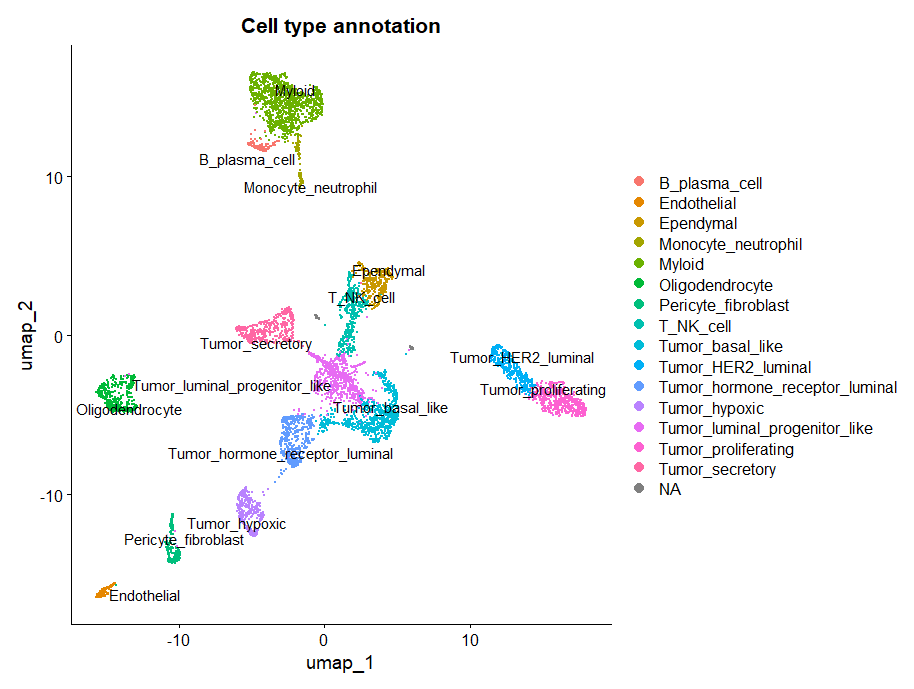

**Figure 1.** Global cellular landscape and marker gene expression in brain metastases. UMAP visualization of integrated single cells colored by major cell type annotations, encompassing malignant epithelial subsets, stromal populations, neuro-glial lineage, and immune compartments. 

#### Differential expression annotation of the Myeloid sub-clusters
Sub-clustering restricted to the myeloid compartment further dissected four distinct sub-populations: Macrophages, Macrophage_MMP9_high_mito, Microglia, and type 2 conventional dendritic cells (cDC2).

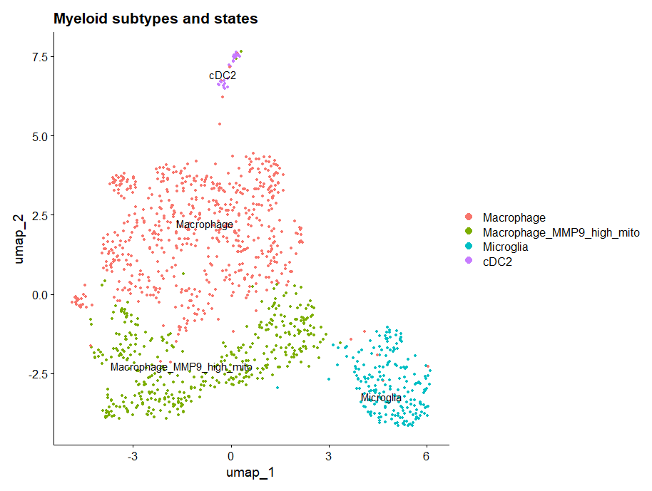

**Figure 2.** Myeloid subtype characterization and M1/M2 polarization states.UMAP embedding of high-resolution sub-clustered myeloid populations identifying Macrophages, Macrophage_MMP9_high_mito, Microglia, and cDC2s.

#### Determining, Annotation, and Visualizations of M1 and M2 states
Differential M1 minus M2 scoring projected across UMAP space highlighted continuous spatial gradients of polarization rather than discrete binary phenotypes. Quantitative proportion analysis confirmed that M1-like state activation predominated in both lineages, accounting for 85.4% of microglia and 50.7% of macrophages, whereas M2-like state polarization (24.5%) and intermediate states (24.9%) were substantially more prevalent within macrophages.

#### Differential Expression Analysis and Volcano Plot Visualization of Fibroblasts
A customized volcano plot visualization framework effectively segregated statistically significant genes (FDR < 0.01 and log_2FC > 1) from minor or non-significant expression changes.

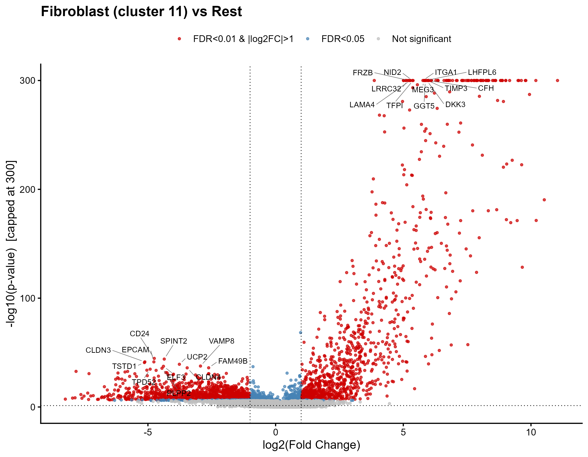

**Figure 3.** Differential expression and functional enrichment of fibroblasts. Volcano plot displaying differentially expressed genes in fibroblasts (FDR < 0.01, log_2FC > 1) compared to all other cell types.

#### Functional Enrichment Analysis (GO, KEGG, Reactome)
Enrichment analysis of directionally separated differentially expressed genes revealed distinct functional programs governed by upregulated and downregulated gene cascades. Over-representation analysis across GO categories (BP, MF, CC), KEGG pathways, and Reactome pathways successfully identified significant biological terms (FDR < 0.05).

#### Pathway Enrichment of Fibroblasts:
Comparison of the fibroblast/pericyte population against all other cell types highlighted a localized transcriptomic signature enriched for extracellular matrix (ECM) remodeling and structural cell functions. Volcano plot analysis identified key upregulated fibroblast markers (FDR < 0.01, log_2FC > 1). Downstream functional profiling across REACTOME, KEGG, and GO sub-ontologies confirmed strong positive enrichment for biological processes related to collagen organization.

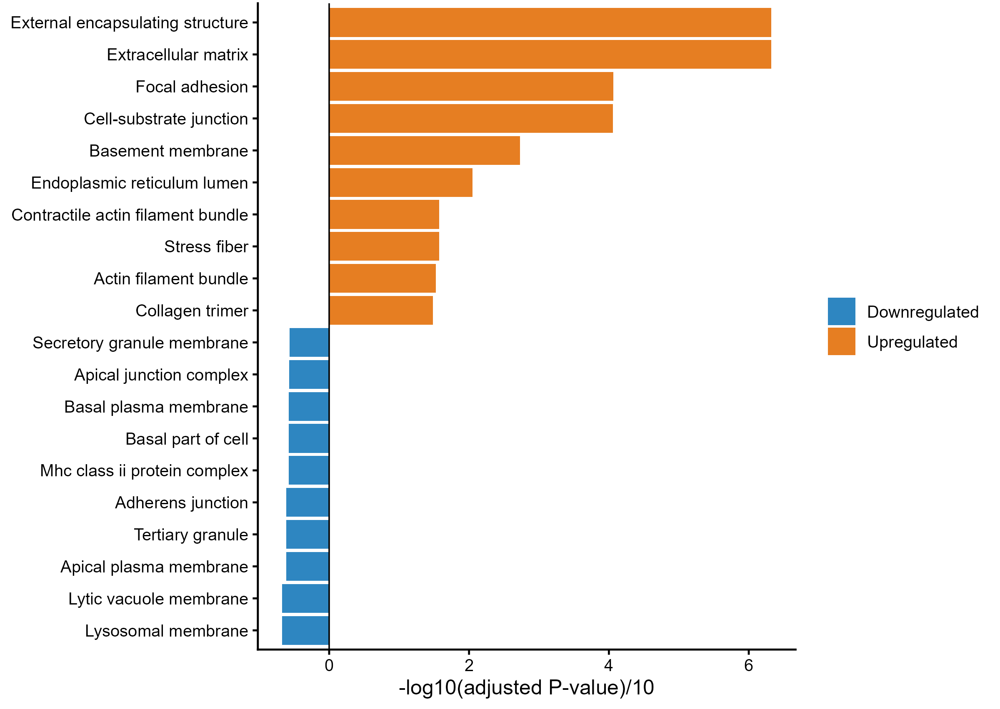

**Figure 4.** Differential expression and functional enrichment of fibroblasts. Diverging bar plot showing enriched GO Cellular Component (CC) terms for upregulated (positive values) and downregulated (negative values) genes in fibroblasts.
 
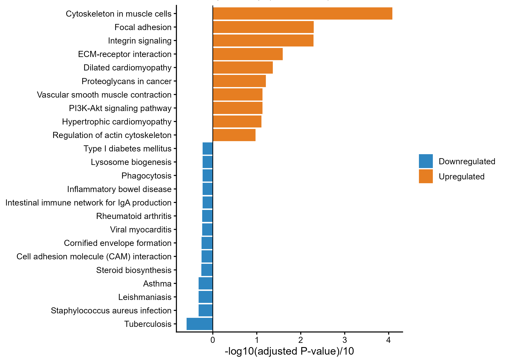

**Figure 5.** Differential expression and functional enrichment of fibroblasts. Diverging bar plot showing enriched KEGG pathways for upregulated (positive values) and downregulated (negative values) genes in fibroblasts.

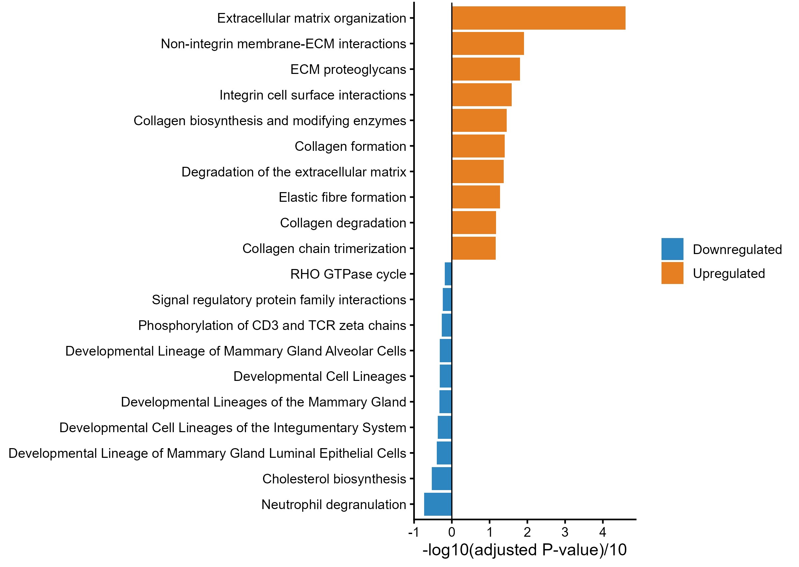

**Figure 6.** Differential expression and functional enrichment of fibroblasts. Diverging bar plot showing enriched REACTOME pathways for upregulated (positive values) and downregulated (negative values) genes in fibroblasts.

##### Differential Expression of M1-like vs. M2-like Macrophages
Transcriptional module scoring successfully stratified the macrophage cluster into distinct functional polarization states, including M1-like, M2-like, and intermediate sub-populations. Direct differential expression analysis contrasting M1-like against M2-like macrophages revealed clear marker separation. 

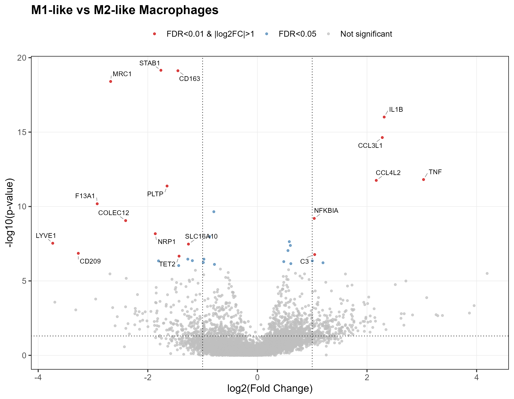

**Figure 7.** Differential expression and functional enrichment of macrophage polarization states. Volcano plot displaying differentially expressed genes between M1-like and M2-like macrophages (FDR < 0.05, log_2FC > 1).

#### Pathway Enrichment Analysis of Macrophage Polarization States
Functional enrichment analysis of macrophage polarization states confirmed distinct metabolic and signaling profiles between M1-like and M2-like phenotypes. 

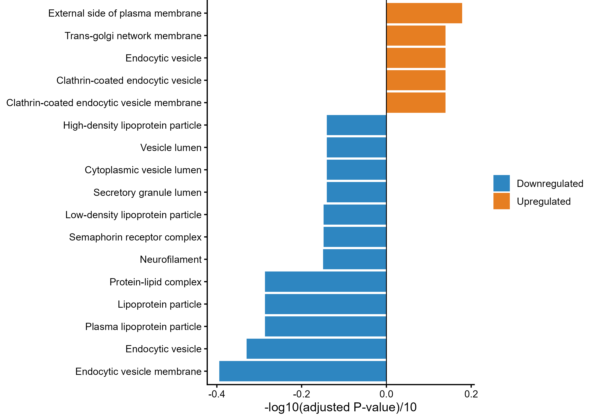

**Figure 8.** Differential expression and functional enrichment of macrophage polarization states. Diverging bar plot showing enriched GO Cellular Component (CC) terms for upregulated (positive values) and downregulated (negative values) genes in M1-like versus M2-like macrophages.

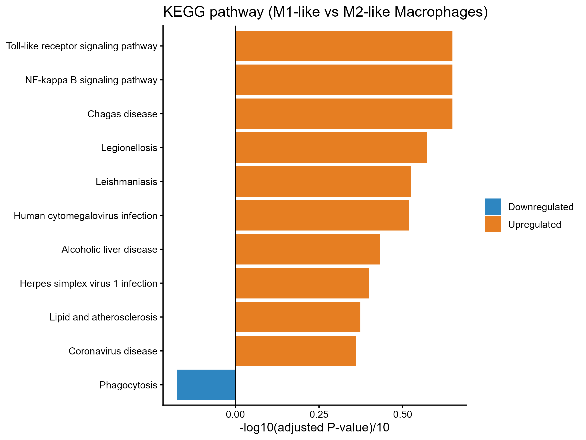

**Figure 9**. Differential expression and functional enrichment of macrophage polarization states. Diverging bar plot showing enriched KEGG pathways for upregulated (positive values) and downregulated (negative values) genes in M1-like versus M2-like macrophages.

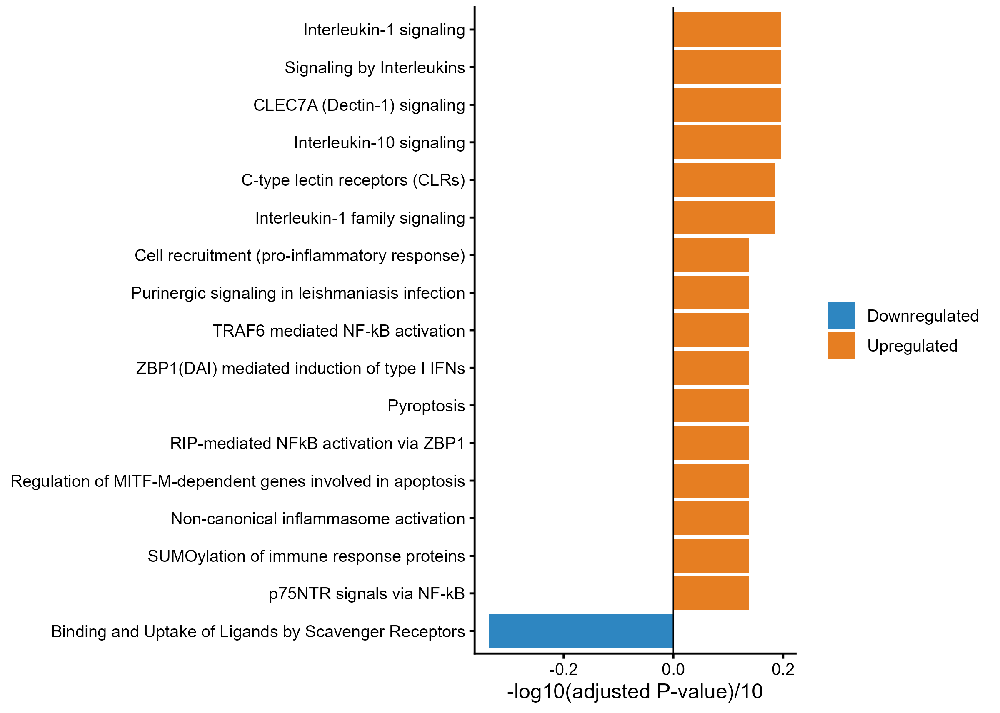

**Figure 10.** Differential expression and functional enrichment of macrophage polarization states. Diverging bar plot showing enriched REACTOME pathways for upregulated (positive values) and downregulated (negative values) genes in M1-like versus M2-like macrophages.

#### Transcriptional Module Scoring of M1-like vs. M2-like Macrophages
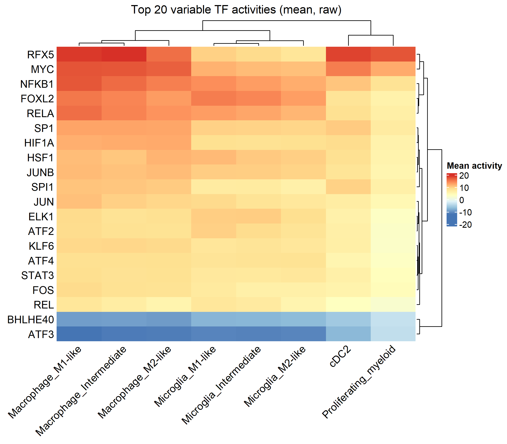

**Figure 11.** Transcription factor activity analysis of macrophage polarization states. Heatmap displaying the top 20 transcription factors with differential activity between M1-like and M2-like macrophages, inferred from regulon analysis.

#### Overall Communication Network using CellChat Model
Aggregated cell-cell communication analysis across all signaling pathways revealed extensive crosstalk among microenvironmental cell populations. Overall interaction counts and weights were heavily dominated by bidirectional signaling between Macrophage_M1-like and Macrophage_M2-like subsets. Pericyte_fibroblasts additionally exhibited robust paracrine communication with both macrophage polarization states, whereas Microglia populations displayed comparatively fewer total interactions across the network

**Figure 12.** Global cell-cell communication network across the brain metastasis microenvironment. Circular network plot displaying the total interaction strength (weighted communication probability) aggregated across all signaling pathways. Edge thickness corresponds to signaling strength
#### Ligand-Receptor Interactions
Detailed evaluation of ligand-receptor pairs (p < 0.01) demonstrated significant variation across target cell pairs. Evaluation of fibroblast-derived signaling revealed distinct receptor-binding preferences across recipient myeloid populations, particularly regarding Syndecan-4 (SDC4) interactions. Fibroblasts engaged M1-like macrophages (Pericyte_fibroblast -> Macrophage_M1-like) through collagen–SDC4 pairs (COL1A1–SDC4, COL6A1–SDC4, and COL9A3–SDC4) as well as MDK–SDC4 signaling. Crucially, these SDC4-mediated interactions were completely absent in M2-like macrophages (Pericyte_fibroblast -> Macrophage_M2-like), which interacted with fibroblast-derived collagens exclusively via CD44 (COL1A1–CD44, COL6A1–CD44, COL9A3–CD44). A similar polarization pattern was mirrored in microglia, where M1-like microglia retained low-level COL1A1–SDC4 communication while both M1- and M2-like microglia primarily engaged CD44.

**Figure 13.** Fibroblast-centric ligand-receptor communication landscape.Faceted dot plot displaying significant (p < 0.01) ligand-receptor interactions originating from Pericyte_fibroblasts across target recipient cell types. Color intensity represents communication probability. Collagen and Midkine signaling demonstrate selective SDC4 receptor engagement in M1-like macrophages compared to CD44-predominant binding in M2-like macrophages.

#### Agreement with the original article (Song et al.) and what is novel:

**Table 1.** Comparison of findings: Agreement with Song et al. and our novel discoveries.

Two differences from Song et al. should be noted. They treated myeloid cells as one population and inferred M1 activation from cytokine expression, while we scored individual cells and split them into M1-like, M2-like and intermediate states. In addition, they list TGFB1 among M1 hallmark genes, whereas we included TGFB1 in the M2 gene set; marker definitions for M1/M2 differ between studies.

#### Conclusion

Overall, our re-analysis reproduces the central findings of Song et al. (a collagen-rich fibroblast population and a pro-inflammatory myeloid compartment) and adds new candidate features: an M1-restricted fibroblast-SDC4 axis, and a shared MIF/APP-CD74 axis, together with a TLR/NF-κB TF signature in M1-like macrophages.

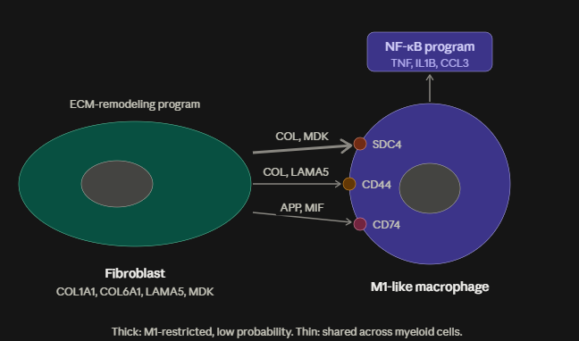
