# Mapping Brain Metastases Intercellular Communication Pathways Between Fibroblast and Myeloid Subclusters Using Single-Cell RNA Sequencing

### Group project by:
*Abdulrahman Alaa*	      [][https://github.com/abdul-rahman-alaa] 
*Fayza Khaled*	          [][https://github.com/fayzakhaled396-creator]
*Jasmine Mohamed*        [][https://github.com/jasminemohamed-bio]
*Rana Mohamed*           [][https://github.com/Rana-Elromh]
*Mostafa Hassanein*	     [][https://github.com/mostafahassaneinn]
 

## Project Description
Brain metastases represent a major clinical challenge characterized by a highly specialized tumor microenvironment (TME). To dissect the cellular architecture and intercellular cross-talk within this niche, this project presents a single-cell RNA sequencing (scRNA-seq) **re-analysis** of the human brain metastatic microenvironment. By integrating high-resolution single-cell transcriptomics with ligand-receptor network modeling, we systematically map the heterogeneous cell states and signaling crosstalk between specific tumor-associated fibroblast (TAF) cluster and M1 macrophage populations. Unraveling these specialized intercellular communication pathways provides critical insights into TME remodeling, offering prospective targets for therapeutic intervention and microenvironment-directed strategies.

### Background 
Brain metastases affect approximately 200,000 patients annually in the US, occurring ten times more frequently than primary brain tumors and carrying high mortality and recurrence rates. While advances in targeted therapies and radiosurgery have improved patient management, effective biomarkers and therapeutic targets remain urgently needed. Evidence indicates that the tumor microenvironment (TME) significantly dictates response to radiotherapy and overall survival, with pan-brain metastasis markers, such as type I collagen genes (COL1A1/COL1A2), playing key roles across diverse primary cancer origins. Leveraging single-cell RNA sequencing (scRNA-seq) on five brain metastasis samples, this study constructs a high-resolution cell landscape, identifying type I collagen-high tumor-associated fibroblasts (TAFs) as central mediators of TME intercellular communication. The findings suggest that M1 activation of resident microglia and infiltrating macrophages establishes a pro-inflammatory, wound-healing response that metastatic tumor cells hijack—driving excess collagen expression to remodel the brain niche into a hospitable microenvironment and offering novel predictive biomarkers and therapeutic targets for metastatic brain cancer and glioblastoma.

### Rationale
We hypothesized that tumor-associated fibroblasts (TAFs) drives immunosuppressive and structural remodeling of the brain metastatic microenvironment by engaging in distinct ligand-receptor signaling crosstalk with M1 macrophage populations. We reasoned that high-resolution single-cell re-analysis and intercellular network modeling would resolve these specific communication axes, demonstrating that targeting this TAF–macrophage signaling circuit can disrupt pro-tumoral TME remodeling and reveal novel therapeutic vulnerabilities in human brain metastases.

### Data Availability & Reference
The single-cell RNA-seq data used in this reanalysis is available in the NCBI Gene Expression Omnibus (GEO) database under accession number **[GSE234832](https://www.ncbi.nlm.nih.gov/geo/query/acc.cgi?acc=GSE234832)**.

If you use this data, please cite the original study:
> Song Q, Ruiz J, Xing F, Lo HW et al. (2023). **Single-cell sequencing reveals the landscape of the human brain metastatic microenvironment.** *Commun Biol* 6, 760. 
> DOI: [10.1038/s42003-023-05124-2](https://www.nature.com/articles/s42003-023-05124-2) | PMID: [37479733](https://pubmed.ncbi.nlm.nih.gov/37479733/)

### Dataset Description
Data from five brain metastasis samples were loaded and processed using Seurat. The dataset included three breast cancer brain metastasis samples and two lung cancer brain metastasis samples.
The samples were identified as:
•	BRBMET2
•	BRBMET3
•	BRBMET87
•	LUBMET7
•	LUBMET1
The expression matrices, feature annotations, and cell barcodes were loaded for each sample and converted into Seurat objects for downstream analysis.

### Methods
##### Summary
*Preprocessing & Integration*: Single-cell RNA-seq data from five samples underwent quality control using adaptive MAD thresholds, doublet removal via scDblFinder, log-normalization, feature scaling, and Harmony batch integration.
*Clustering & Cell Annotation*: Unsupervised clustering and UMAP/t-SNE visualization were performed. Cell types were annotated using SingleR and canonical markers, with a primary focus on isolating and sub-clustering the myeloid population.
*Polarization & Enrichment Analysis*: Myeloid cells were evaluated for M1-like (pro-inflammatory) and M2-like (immunosuppressive) functional states using module scoring. Differentially expressed genes and functional pathway enrichments (GO, KEGG, Reactome) were analyzed across clusters and polarization states.
*Cell-Cell Communication*: The CellChat framework modeled ligand-receptor interactions to map microenvironmental crosstalk, specifically evaluating communication pathways between fibroblasts and M1/M2-polarized myeloid sub-clusters.

#### Data Loading
The five samples (BRBMET2, BRBMET3, BRBMET87, LUBMET7, and LUBMET1) were read from sparse matrix format (matrix.mtx.gz, features.tsv.gz, and barcodes.tsv.gz) using the ReadMtx function in Seurat. Individual Seurat objects were constructed for each sample without initial threshold filtering (min.cells = 0, min.features = 0).

#### Quality Control and Doublet Removal
Cell quality control was performed independently for each sample using adaptive thresholding based on median absolute deviations (MAD). Mitochondrial gene expression percentages (percent.mt) were calculated using PercentageFeatureSet for genes matching the ^MT- prefix. Cells were retained if their mitochondrial transcript percentage was below an upper boundary defined as min({median} + 3*{MAD}, 40\%) and their detected gene counts (nFeature_RNA) fell within max(200, {median} - 3*{MAD}) and {median} + 3*{MAD}. High-quality cells across all five filtered samples were merged into a single Seurat object and joined across layers. To remove heterotypic doublets, the merged dataset was converted into a SingleCellExperiment object, and scDblFinder was executed with sample-level batch stratification (samples = "orig.ident"). Cells classified as doublets were removed, retaining only verified singlets for downstream processing.

#### Normalization, Identification of Variable Features, and Scaling
Gene expression counts of the singlet population were normalized using standard log-normalization via NormalizeData, scaling feature counts per cell by a factor of 10,000 and natural log-transforming the result (LogNormalize). Highly variable features were identified using the variance-stabilizing transformation method (selection.method = "vst") in FindVariableFeatures, selecting the top 2,000 variable genes. Linear scaling was subsequently applied across all genes using ScaleData to center expression measurements to a mean of zero and scale variance to one.

#### Principal Component Analysis (PCA)
Linear dimensional reduction was performed on the scaled expression matrix of the top 2,000 highly variable features using RunPCA. Dimensional loadings and primary sources of variation were evaluated across the top principal components. The proportion of variance explained by individual PCs was assessed using elbow plot visualization (ElbowPlot) over 50 dimensions to determine the optimal component cutoff for batch alignment and downstream embeddings.

#### Harmony Integration
To mitigate sample-specific batch effects across the five metastasis specimens, batch correction was executed on the top 30 principal components using the Harmony algorithm (RunHarmony) with sample identity (orig.ident) set as the batch variable and a diversity penalty parameter (theta = 4). Harmony embeddings (harmony) were generated for downstream dimensional reduction and graph-based clustering.

#### Clustering
Graph-based unsupervised clustering was performed before and after Harmony batch correction for comparison. Cell-cell similarity graphs were constructed using FindNeighbors based on either the first 30 uncorrected principal components or the first 30 Harmony-integrated dimensions. Community detection was subsequently executed using FindClusters at a modularity resolution of 0.5.

#### Clusters Visualization (UMAP and t-SNE)
For non-linear dimensional reduction and spatial visualization, Uniform Manifold Approximation and Projection (UMAP) embeddings were generated before (umap_pca) and after batch correction (umap) using the first 30 dimensions. In addition, t-Distributed Stochastic Neighbor Embedding (t-SNE) was performed on the 30 Harmony dimensions (RunTSNE, reduction.name = "tsne_harmony"). Cluster distributions and batch mixing across individual samples were evaluated on UMAP and t-SNE projections.

#### Identification of Clusters Marker Genes
Differentially expressed gene (DEG) markers defining each integrated cluster were identified using Seurat's FindAllMarkers function. Non-parametric Wilcoxon rank-sum tests were conducted evaluating positively expressed genes (only.pos = TRUE) detected in a minimum fraction of 25% of cells in either comparison group (min.pct = 0.25) with a natural log fold-change threshold of at least 0.25 (logfc.threshold = 0.25). The top 5 marker genes per cluster were ranked by average log2 fold-change (avg_log2FC).

#### Identification and Sub-clustering of Myeloid Cells
The myeloid cell population was identified by evaluating average cluster-level expression of canonical myeloid markers (TREM2, C1QB, GPR34, FOLR2, and C1QC) using AverageExpression. Cells belonging to the primary myeloid cluster (Cluster 0) were isolated and re-processed. Highly variable features (top 2,000 genes) were re-selected, scaled, and subjected to PCA. Harmony batch integration was re-applied across the top 20 principal components (dims.use = 1:20, theta = 4). Sub-clustering was performed at a resolution of 0.5 on the Harmony neighborhood graph, followed by UMAP projection (RunUMAP). Sub-cluster-specific marker genes were identified via FindAllMarkers, and canonical lineages/states were validated using feature expression plots (FeaturePlot) for myeloid lineage.

#### Automated Annotation of the defined clusters
Automated cell-type annotation of the single-cell transcriptomic dataset was performed using the SingleR package. The Seurat object was converted into a SingleCellExperiment object and queried against two reference datasets from the celldex package: the Human Primary Cell Atlas Data (HumanPrimaryCellAtlasData) and the Monaco Immune Data (MonacoImmuneData). Main cell-type labels (label.main) from both references were utilized simultaneously to assign predictions to individual cells. The resulting predicted labels were added back to the Seurat object metadata and visualized using Uniform Manifold Approximation and Projection (UMAP) dimensionality reduction plots generated via DimPlot.

#### Differential expression annotation of the defined clusters
To biologically annotate and refine the unsupervised clusters, marker genes for each cluster were identified using Seurat's FindAllMarkers function, restricting evaluation to upregulated genes (only.pos = TRUE) with a minimum expression fraction threshold (min.pct = 0.25) and a log2 fold-change threshold (logfc.threshold = 0.25). The top 25 marker genes per cluster based on average log2 fold-change (avg_log2FC) were extracted and saved. Clusters 0 through 14 were manually annotated into broad lineages and tumor states based on marker expression signatures.  Identified cell types were assigned to active cluster identities and visualized on UMAP plots.

#### A heatmap as QC to Check for NAs
Prior to expression visualization, quality control checks were conducted on the cell type metadata (cell_type) to verify data integrity and confirm the absence of missing values (NA). Cells with valid annotations were retained, and expression patterns of selected marker genes (genes_to_plot) across cell-type identities were visualized using Seurat's DoHeatmap. Gene expression values were scaled and displayed using a custom color gradient.

#### Differential expression annotation of the Myeloid sub-clusters
Sub-clustering analysis was focused on the myeloid lineage. Differential expression analysis was performed on the myeloid sub-clusters, and significant markers (padj < 0.05) were filtered. The top 25 markers per sub-cluster ranked by avg_log2FC were exported (top25_myeloid_markers.csv), followed by UMAP visualization.

#### Determining of M1 and M2 states
To characterize functional polarization states within the myeloid population, module scores for canonical M1 (pro-inflammatory) and M2 (anti-inflammatory/immunosuppressive) gene sets were calculated using Seurat's AddModuleScore function. Module scores were evaluated across myeloid sub-clusters via violin plots (VlnPlot), and mean scores as well as score differentials (M1 - M2) were calculated for each sub-cluster.

#### Annotation of M1 and M2 states
Myeloid sub-clusters were consolidated into broader lineages, merging cluster 0 and 1 into "Macrophage" while maintaining "Microglia" and other non-macrophage/microglia populations. A net polarization score was calculated for each cell as Delta S = {M1_score1} - {M2_score1}. 
Polarization states were categorized based on a threshold (= 0.1): cells with Delta S > 0.1 were assigned as "M1-like", cells with Delta S < -0.1 as "M2-like", and cells falling between (-0.1 and 0.1) as "Intermediate". For Macrophage and Microglia lineages, composite annotations combining cell identity and polarization state (e.g., "Macrophage_M1-like") were assigned and visualized using UMAP projections.

#### Visualizations of M1 and M2 states
Polarization dynamics and cell-state distributions were visualized through multiple complementary approaches: (1) UMAP projections of cell types split by polarization state (M1-like, M2-like, Intermediate); (2) UMAP feature plots displaying continuous Delta S values using a divergent color gradient (blue for M1-leaning, red for M2-leaning); (3) stacked bar charts (ggplot2) displaying the relative percentage distribution of M1-like, M2-like, and Intermediate states strictly within Macrophage and Microglia populations; and (4) sub-cluster UMAP feature maps paired with top marker heatmaps (top 5 markers per cluster, padj < 0.05).

#### Differential Expression Analysis and Volcano Plot Visualization
Differential expression analysis was performed using a two-sided Wilcoxon rank-sum test via the FindMarkers function in Seurat with a minimum cell fraction detection threshold (min.pct) of 0.1 and an absolute log2 fold-change threshold of 0. Differential expression results were categorized into significance tiers based on adjusted p-values calculated using the Benjamini-Hochberg false discovery rate (FDR) correction: highly significant (FDR < 0.01 and log_2FC > 1), significant (FDR < 0.05), or non-significant. Volcano plots were constructed using ggplot2 and ggrepel. To prevent visual distortion from extreme pvalues, -log10pvalues were capped at 300. For representative gene annotation, the top 12 upregulated and downregulated genes per contrast were selected based on adjusted pvalue and log2 fold-change filtering, excluding lowly expressed outliers (cell fraction < 0.1) and extreme fold-change fluctuations (log_2FC > 6).

#### Functional Enrichment Analysis (GO, KEGG, Reactome)
Directional functional enrichment analysis was conducted separately for significantly upregulated (log_2FC > 1, FDR < 0.05) and downregulated (log_2FC < -1, FDR < 0.05) genes. Gene symbols were mapped to Entrez Gene IDs using the org.Hs.eg.db R package via clusterProfiler::bitr. 
Over-representation analysis (ORA) was executed across Gene Ontology (GO) categories—Biological Process (BP), Molecular Function (MF), and Cellular Component (CC), as well as Kyoto Encyclopedia of Genes and Genomes (KEGG) pathways using clusterProfiler, and Reactome pathways using ReactomePA. Multiple-testing adjustments were performed using the Benjamini-Hochberg method, with terms exhibiting an adjusted pvalue < 0.05 considered statistically enriched.

#### Pathway Enrichment Visualization
To facilitate intuitive comparison of biological themes across expression states, enriched functional terms were visualized using bidirectional diverging bar charts in ggplot2. The top 10 most significantly enriched terms (FDR < 0.05) for upregulated and downregulated gene sets were plotted along a continuous normalized axis. Enriched pathways associated with upregulated genes were represented along positive values, whereas downregulated pathways extended along negative values. To handle potential duplicate descriptions across categories, uniquely formatted labels were mapped back to their original term names while preserving factor ordering.

#### Differential Expression and Pathway Enrichment of Fibroblasts
Fibroblasts (pericyte/fibroblast cluster 11) were evaluated for differential gene expression against all remaining cell populations in the single-cell dataset using the Wilcoxon rank-sum test. Identified marker genes (FDR < 0.01, log_2FC > 1) were saved, and directional enrichment analysis was performed across REACTOME, KEGG, and GO ontologies (BP, MF, CC). Separate diverging bar plots were generated to visualize enriched biological functions characteristic of the fibroblast population.

#### Differential Expression of M1-like vs. M2-like Macrophages
Myeloid single-cell clusters were annotated and subsetted to isolate macrophages and microglia. Polarization module scores for M1-like and M2-like transcriptional signatures were computed per cell using AddModuleScore. Individual cells were categorized into polarization states based on the score differential (M1 - M2): M1-like (> 0.1), M2-like (< -0.1), or Intermediate. A direct differential expression contrast was then executed between M1-like macrophages (ident.1) and M2-like macrophages (ident.2) using the volcano plot.

#### Pathway Enrichment Analysis of Macrophage Polarization States
Genes differentially expressed between M1-like and M2-like macrophages (FDR < 0.05, log_2FC > 1) were subjected to ORA using clusterProfiler and ReactomePA. Biological enrichment patterns were evaluated across REACTOME pathways, KEGG pathways, and GO sub-ontologies. Enriched processes specific to M1-like (positive scores) versus M2-like (negative scores) states were displayed as diverging bar plots.

#### CellChat Model Construction and Ligand-Receptor Database Mapping
Single-cell transcriptomic profiles were integrated across datasets to focus on microenvironmental interaction dynamics. Myeloid sub-clusters annotated by functional polarization state replaced the myeloid cluster, followed by assay layer integration (JoinLayers) under the default RNA assay within Seurat. The dataset was subsequently filtered to isolate five key cell populations of interest: pericytes/fibroblasts (Pericyte_fibroblast), M1-like macrophages (Macrophage_M1-like), M2-like macrophages (Macrophage_M2-like), M1-like microglia (Microglia_M1-like), and M2-like microglia (Microglia_M2-like).

Inferred cell-cell communication networks were reconstructed using the CellChat R package. Expression matrices and cell metadata annotations were extracted to initialize a CellChat object grouped by DEG_annotation. Human ligand-receptor interactions were assigned from CellChatDB.human. To optimize computational performance without altering signal detection, the expression matrix was subsetted (subsetData) to retain only genes corresponding to established ligands and receptors present within the curated database.

#### Identification of Overexpressed Signal Pairs and Network Inference
Overexpressed signaling genes across the defined cell clusters were identified using identifyOverExpressedGenes paired with presto-accelerated differential expression. Overexpressed ligand-receptor interactions were subsequently determined (identifyOverExpressedInteractions) by filtering for pairs in which both signaling partners demonstrated significant group-wise overexpression. Communication probabilities between cell clusters were calculated (computeCommunProb) using law of mass action modeling based on average ligand and receptor expression levels. Interactions originating from rare cell groups containing fewer than 10 cells were removed using filterCommunication to mitigate low-confidence observational noise.

#### Pathway Communication Network Aggregation
Individual ligand-receptor communication probabilities were aggregated to evaluate signaling strengths at the pathway level (computeCommunProbPathway). Total network interactions were synthesized using aggregateNet to generate cell-group interaction matrices corresponding to raw signaling counts and weighted communication probabilities (strength). In addition, cell-type-specific signaling subsets were generated by filtering communication outputs specifically for pericyte/fibroblast source populations (sources.use = "Pericyte_fibroblast").

#### Network Visualization and Ligand-Receptor Interactions
Macro-level communication structure was visualized using circular network plots (netVisual_circle) displaying total interaction counts and weighted interaction strengths across all cell groups. Enriched signaling pathways were extracted, and individual pathway networks were rendered into high-resolution circular plots using automated layout functions (netVisual_aggregate). Communication data frames containing inferred probabilities and significance metrics (p < 0.01) were extracted via subsetCommunication. Custom processing pipelines generated faceted dot plots visualizing communication probabilities across target cell pairs, evaluated both globally and specifically for fibroblast-directed interactions, while systematically comparing networks with and without self-communication.

### Results

#### Data Loading
Single-cell transcriptomic profiles were successfully loaded across all five brain metastasis specimens (BRBMET2, BRBMET3, BRBMET87, LUBMET7, and LUBMET1), generating independent initial Seurat objects for each dataset.

#### Quality Control and Doublet Removal
Sample-specific adaptive thresholding based on median absolute deviations effectively filtered out low-quality dying cells with high mitochondrial read content and unviable transcript counts. In silico doublet detection using scDblFinder identified and removed artificial cell multiplets from the merged dataset, yielding a clean singlet population for downstream integrative analyses.

Quality control filtering and doublet removal of the single-cell RNA sequencing data yielded a robust dataset for downstream analysis. Initially, a total of 10,896 cells were processed before quality control, of which 7,158 cells successfully passed filtering criteria. Subsequent doublet detection identified and removed 323 doublets, resulting in a final high-quality dataset of 6,835 singlet cells retained for downstream clustering and cell type annotation.

#### Normalization, Identification of Variable Features, and Scaling
After normalisation, identification of highly variable features across the single-cell dataset yielded 2,000 highly variable genes out of 33,538 total detected features, with ACY3 and COL3A1 exhibiting the highest standardized variance.

**Figure 1.** Variable feature selection and principal component analysis. Variance plot showing 2,000 highly variable genes (red) selected from 33,538 total detected genes, with top variable genes labeled (ACY3, COL3A1).
#### Principal Component Analysis (PCA)
Principal component analysis effectively captured major biological axes of variation across the top dimensions. Principal component analysis (PCA) based on these variable genes revealed distinct sample-level driver patterns along the major axes of variation. PC_1 clearly separated LUBMET1 samples along the negative axis from BRBMET87 samples aligned along positive PC_2, while BRBMET2, BRBMET3, and LUBMET7 populated intermediate distribution spaces. Top loading genes driving PC_1 highlighted opposing transcriptional profiles, with oligodendrocyte- and CNS-associated markers (PLP1, TF, MOG, APLP1, CARNS1, NKX6-2, STMN4, ENPP2) enriched on one spectrum, and epithelial/metastatic and inflammatory drivers (SPDEF, CREB3L4, IER3, LY6E, HMGB3, S100A14, FXYD3, S100A10) defining the opposing axis.

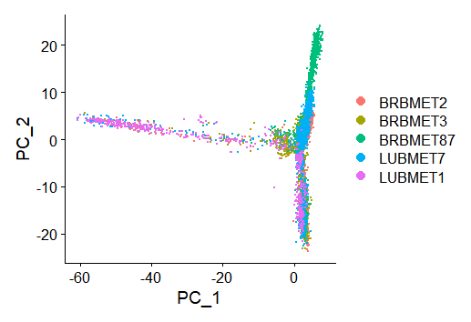

**Figure 2.** PCA scatter plot showing single cells projected onto PC_1 and PC_2, colored by sample origin.  

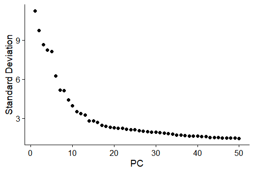

**Figure 3.** Elbow plot of principal components. Standard deviations of the top principal components derived from highly variable genes. Inspection of the elbow plot confirmed that the top 30 principal components accounted for the majority of transcriptomic variance within the dataset.

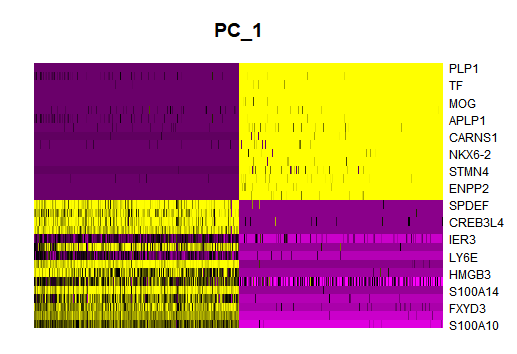

**Figure 4.** Heatmap displaying the top driving genes along PC_1.

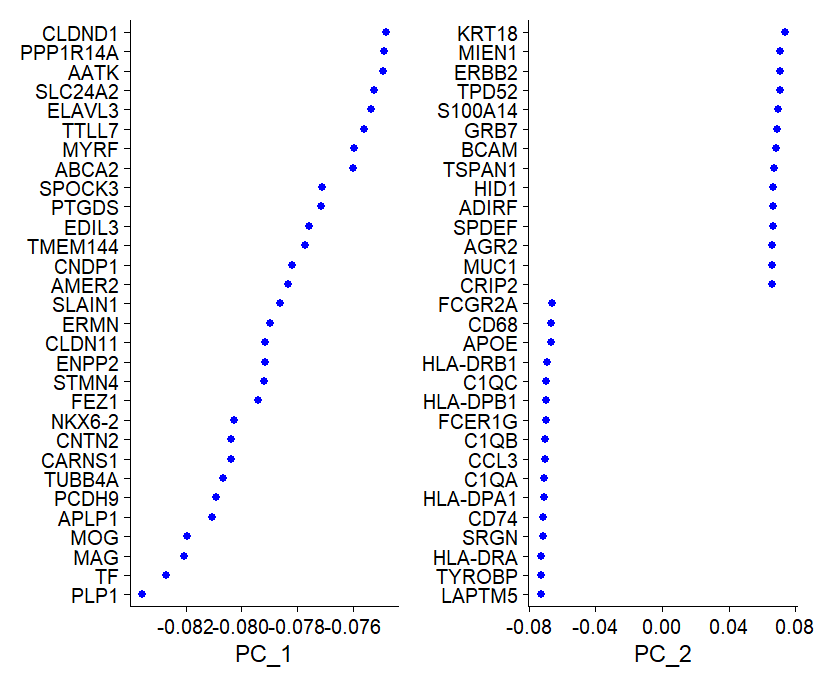

**Figure 5.** Top gene loadings for principal components 1 and 2.

#### Harmony Integration, Clustering, and Visualization (UMAP and t-SNE)
Unsupervised clustering across the dataset identified 16 distinct transcriptomic clusters (Clusters 0–15). Prior to integration, uncorrected UMAP embedding exhibited pronounced batch-driven separation, with individual clusters composed almost exclusively of single samples (e.g., BRBMET2, BRBMET87, and LUBMET7 segregating into isolated islands). Application of Harmony batch correction successfully mitigated sample-specific variation, driving multi-sample alignment across central shared clusters while preserving true biological heterogeneity. Both post-Harmony UMAP and t-SNE projections demonstrated consistent spatial topology, effectively grouping homologous cell states across diverse patient origins.

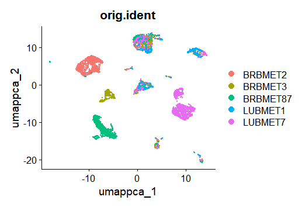

**Figure 6.** Evaluation of batch correction and single-cell embedding. Uncorrected UMAP plot colored by sample identity, showing pre-integration batch effects.

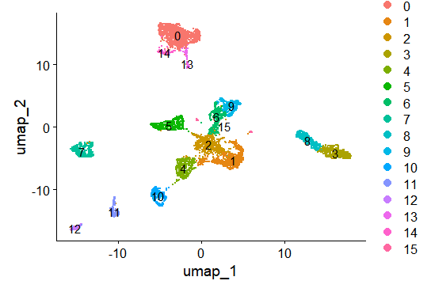

**Figure 7.** Evaluation of batch correction and single-cell embedding. Post-Harmony UMAP plot colored by unsupervised Seurat clusters (0–15).

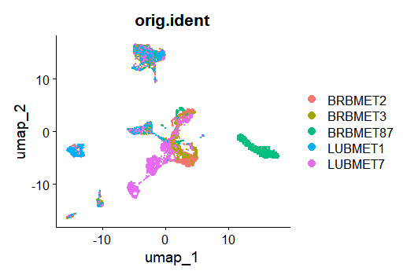

**Figure 8.** Evaluation of batch correction and single-cell embedding. Post-Harmony UMAP plot colored by sample identity, demonstrating integration across shared cluster spaces.

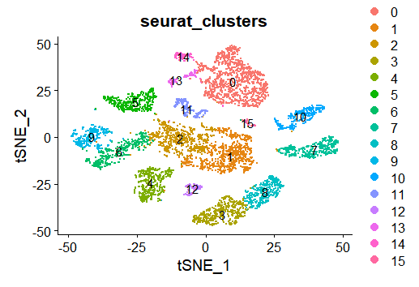

**Figure 9.** Evaluation of batch correction and single-cell embedding. Post-Harmony t-SNE plot colored by Seurat clusters.

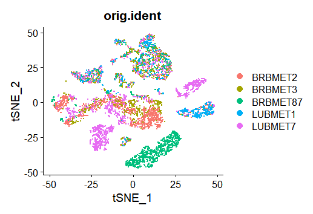

**Figure 10.** Evaluation of batch correction and single-cell embedding. Post-Harmony t-SNE plot colored by sample identity.

#### Identification and Sub-clustering of Myeloid Cells
To determine the principal components (PCs) capturing the highest proportion of biological variance, elbow plot evaluation revealed a distinct inflection point around PC 8–10, beyond which standard deviation plateaued. Non-linear dimensionality reduction using UMAP on the top principal components resolved 7 distinct transcriptomic sub-clusters (Clusters 0–6). Post-integration overlay confirmed uniform distribution across all five patient samples (BRBMET2, BRBMET3, BRBMET87, LUBMET1, and LUBMET7), demonstrating effective batch correction without sample-specific subset bias. Expression profiling of canonical lineage markers revealed that the subset is heavily enriched for myeloid and macrophage populations. High expression of complement genes (C1QC, C1QB) alongside lipid metabolism and phagocytic markers (TREM2, FOLR2, LYZ) was localized across the primary contiguous clusters (Clusters 0, 1, and 3–5). Lymphocyte and cytotoxic markers (CD3D, CD3E, NKG7, GNLY) showed minimal or highly localized expression, while proliferation markers (MKI67) defined a distinct, minor cycling population (Cluster 6)

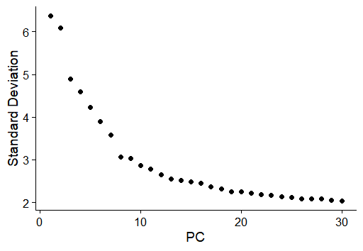

**Figure 11.** PCA elbow plot in subclustering illustrating the standard deviation accounted for by each principal component, with an elbow point observed near PC 8–10.

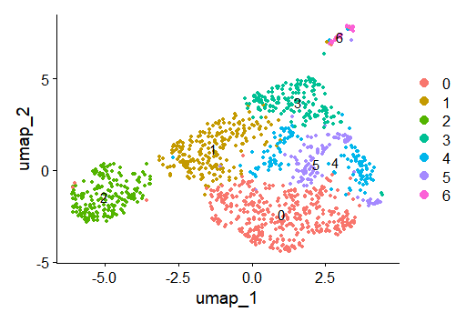

**Figure 12.** Post-Harmony UMAP embedding displaying 7 distinct sub-clusters (Clusters 0–6).

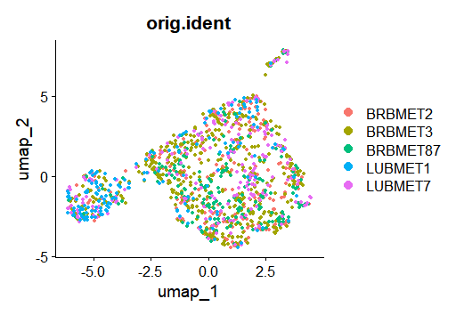

**Figure 13.** UMAP projection colored by sample identity (orig.ident), demonstrating homogenous sample integration and lack of batch effect across sub-clusters of myeloid populations

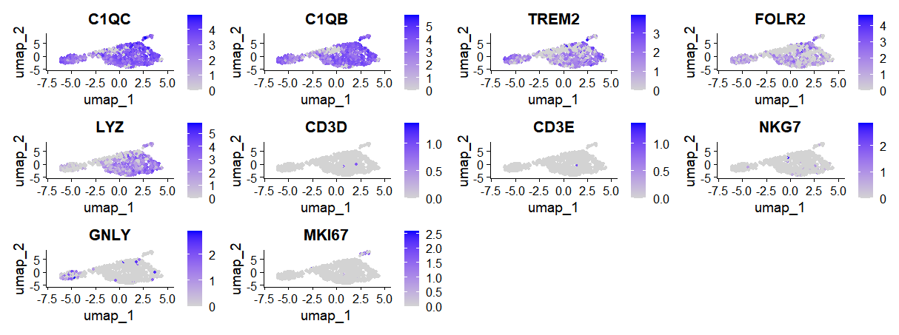

**Figure 14.** Expression landscape of canonical lineage and functional marker genes. Feature plots displaying normalized expression levels of key cell-type markers projected on UMAP space. Myeloid and macrophage-associated markers (C1QC, C1QB, TREM2, FOLR2, LYZ) show broad expression across main clusters. T-cell (CD3D, CD3E), NK cell/cytotoxic (NKG7, GNLY), and proliferative (MKI67) markers show sparse or cluster-restricted expression.

#### Differential expression annotation of the defined clusters
Differential expression analysis via FindAllMarkers identified robust gene expression profiles distinguishing all 15 major clusters (clusters 0–14). Cell identity assignment was confirmed via distinct lineage-specific marker expression on the expression heatmap, including FOLR2, TREM2, and C1QC in myeloid subsets, CD3D, TRBC1, and NKG7 in NK cells, and COL3A1 in pericyte/fibroblasts.  

**Figure 15.** Global cellular landscape and marker gene expression in brain metastases. UMAP visualization of integrated single cells colored by major cell type annotations, encompassing malignant epithelial subsets, stromal populations, neuro-glial lineage, and immune compartments. 

#### Heatmap for annotated clusters

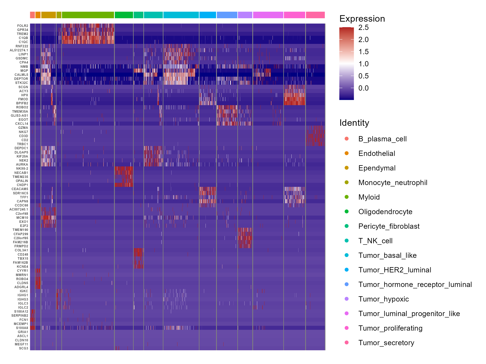

**Figure 16.** Heatmap displaying the top differentially expressed marker genes per cluster (FDR < 0.05, log_2FC > 0.25). Clusters are annotated with cell-type identities based on canonical marker expression.

#### Differential expression annotation of the Myeloid sub-clusters
Sub-clustering restricted to the myeloid compartment further dissected four distinct sub-populations: Macrophages, Macrophage_MMP9_high_mito, Microglia, and type 2 conventional dendritic cells (cDC2).

**Figure 17.** Myeloid subtype characterization and M1/M2 polarization states.UMAP embedding of high-resolution sub-clustered myeloid populations identifying Macrophages, Macrophage_MMP9_high_mito, Microglia, and cDC2s.

#### Determining, Annotation, and Visualizations of M1 and M2 states
Module scoring for canonical pro-inflammatory (M1) versus anti-inflammatory/immunosuppressive (M2) transcriptional signatures revealed that microglia exhibit elevated baseline M1 score profiles compared to macrophages. 
Differential M1 minus M2 scoring projected across UMAP space highlighted continuous spatial gradients of polarization rather than discrete binary phenotypes. Quantitative proportion analysis confirmed that M1-like state activation predominated in both lineages, accounting for 85.4% of microglia and 50.7% of macrophages, whereas M2-like state polarization (24.5%) and intermediate states (24.9%) were substantially more prevalent within macrophages.

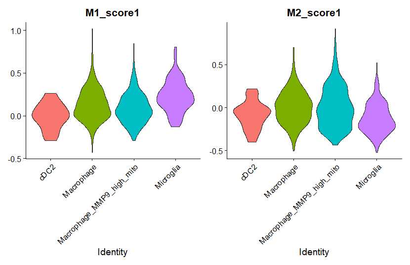

**Figure 18.** Myeloid subtype characterization and M1/M2 polarization states. Violin plots showing module score distributions for M1 (left) and M2 (right) transcriptomic signatures across myeloid sub-types.   

**Figure 19.** UMAP feature plot displaying the composite polarization score (M1 score minus M2 score) of myeloid subtype characterization and M1/M2 polarization states, where positive values (blue) denote M1-like skewing and negative values (red) denote M2-like skewing.

**Figure 20.** Myeloid subtype characterization and M1/M2 polarization states. Stacked bar plot illustrating the relative proportion of M1-like, M2-like, and intermediate polarization states among Macrophage and Microglia lineages.

#### Differential Expression Analysis and Volcano Plot Visualization
A customized volcano plot visualization framework effectively segregated statistically significant genes (FDR < 0.01 and log_2FC > 1) from minor or non-significant expression changes.

**Figure 21.** Differential expression and functional enrichment of fibroblasts. Volcano plot displaying differentially expressed genes in fibroblasts (FDR < 0.01, log_2FC > 1) compared to all other cell types.

#### Functional Enrichment Analysis (GO, KEGG, Reactome)
Enrichment analysis of directionally separated differentially expressed genes revealed distinct functional programs governed by upregulated and downregulated gene cascades. Over-representation analysis across GO categories (BP, MF, CC), KEGG pathways, and Reactome pathways successfully identified significant biological terms (FDR < 0.05).

#### Pathway Enrichment:
Bidirectional diverging bar plots provided a clear visual separation of upregulated and downregulated functional pathways. Terms associated with upregulated genes exhibited positive normalized enrichment scores, while downregulated pathways extended along negative values.

##### Differential Expression and Pathway Enrichment of Fibroblasts
Comparison of the fibroblast/pericyte population against all other cell types highlighted a localized transcriptomic signature enriched for extracellular matrix (ECM) remodeling and structural cell functions. Volcano plot analysis identified key upregulated fibroblast markers (FDR < 0.01, log_2FC > 1). Downstream functional profiling across REACTOME, KEGG, and GO sub-ontologies confirmed strong positive enrichment for biological processes related to collagen organization.

**Figure 22.** Differential expression and functional enrichment of fibroblasts. Diverging bar plot showing enriched GO Cellular Component (CC) terms for upregulated (positive values) and downregulated (negative values) genes in fibroblasts.
 

**Figure 23.** Differential expression and functional enrichment of fibroblasts. Diverging bar plot showing enriched KEGG pathways for upregulated (positive values) and downregulated (negative values) genes in fibroblasts.

**Figure 24.** Differential expression and functional enrichment of fibroblasts. Diverging bar plot showing enriched REACTOME pathways for upregulated (positive values) and downregulated (negative values) genes in fibroblasts.

##### Differential Expression of M1-like vs. M2-like Macrophages
Transcriptional module scoring successfully stratified the macrophage cluster into distinct functional polarization states, including M1-like, M2-like, and intermediate sub-populations. Direct differential expression analysis contrasting M1-like against M2-like macrophages revealed clear marker separation. 

**Figure 25.** Differential expression and functional enrichment of macrophage polarization states. Volcano plot displaying differentially expressed genes between M1-like and M2-like macrophages (FDR < 0.05, log_2FC > 1).

#### Pathway Enrichment Analysis of Macrophage Polarization States
Functional enrichment analysis of macrophage polarization states confirmed distinct metabolic and signaling profiles between M1-like and M2-like phenotypes. 

**Figure 26.** Differential expression and functional enrichment of macrophage polarization states. Diverging bar plot showing enriched GO Cellular Component (CC) terms for upregulated (positive values) and downregulated (negative values) genes in M1-like versus M2-like macrophages.

**Figure 27**. Differential expression and functional enrichment of macrophage polarization states. Diverging bar plot showing enriched KEGG pathways for upregulated (positive values) and downregulated (negative values) genes in M1-like versus M2-like macrophages.

**Figure 28.** Differential expression and functional enrichment of macrophage polarization states. Diverging bar plot showing enriched REACTOME pathways for upregulated (positive values) and downregulated (negative values) genes in M1-like versus M2-like macrophages.

#### Transcriptional Module Scoring of M1-like vs. M2-like Macrophages

**Figure 29.** Transcription factor activity analysis of macrophage polarization states. Heatmap displaying the top 20 transcription factors with differential activity between M1-like and M2-like macrophages, inferred from regulon analysis.

#### Overall Communication Network using CellChat Model
Aggregated cell-cell communication analysis across all signaling pathways revealed extensive crosstalk among microenvironmental cell populations. Overall interaction counts and weights were heavily dominated by bidirectional signaling between Macrophage_M1-like and Macrophage_M2-like subsets. Pericyte_fibroblasts additionally exhibited robust paracrine communication with both macrophage polarization states, whereas Microglia populations displayed comparatively fewer total interactions across the network

**Figure 30.** Global cell-cell communication network across the brain metastasis microenvironment. Circular network plot displaying the total number of inferred interactions (counts) between pericytes/fibroblasts, polarized macrophages (M1-like and M2-like), and polarized microglia (M1-like and M2-like). Numbers on directed edges indicate total interaction counts between source and target populations.

**Figure 31.** Global cell-cell communication network across the brain metastasis microenvironment. Circular network plot displaying the total interaction strength (weighted communication probability) aggregated across all signaling pathways. Edge thickness corresponds to signaling strength

#### Specific Pathways Network Inference
Analysis of pathway-specific signaling networks demonstrated distinct cell-type-driven communication axes within the brain metastasis microenvironment. For the COLLAGEN pathway, Pericyte_fibroblasts functioned as the exclusive signal source, directing widespread paracrine interactions toward Macrophage_M1-like, Macrophage_M2-like, Microglia_M1-like, and Microglia_M2-like cells, alongside prominent autocrine signaling. 
Conversely, the Prostaglandin pathway operated primarily through dual signaling hubs: Macrophage_M1-like cells served as a primary sender directing signals to both M1-like and M2-like Microglia alongside autocrine feedback, while Pericyte_fibroblasts independently targeted Macrophage_M1-like, Microglia_M1-like, and Microglia_M2-like populations. Macrophage_M2-like cells showed no active participation in the Prostaglandin network

**Figure 32.** Pathway-specific cell-cell communication networks. Circular network plot of the COLLAGEN signaling pathway, highlighting Pericyte_fibroblasts as the primary signal sender targeting all myeloid sub-populations alongside autocrine signaling.

**Figure 33.** Pathway-specific cell-cell communication networks. Circular network plot of the Prostaglandin signaling pathway, displaying dual signaling hubs centered on Macrophage_M1-like cells and Pericyte_fibroblasts directing paracrine signals toward M1-like and M2-like microglia. 

#### Ligand-Receptor Interactions
Detailed evaluation of ligand-receptor pairs (p < 0.01) demonstrated significant variation across target cell pairs. Evaluation of fibroblast-derived signaling revealed distinct receptor-binding preferences across recipient myeloid populations, particularly regarding Syndecan-4 (SDC4) interactions. Fibroblasts engaged M1-like macrophages (Pericyte_fibroblast -> Macrophage_M1-like) through collagen–SDC4 pairs (COL1A1–SDC4, COL6A1–SDC4, and COL9A3–SDC4) as well as MDK–SDC4 signaling. Crucially, these SDC4-mediated interactions were completely absent in M2-like macrophages (Pericyte_fibroblast -> Macrophage_M2-like), which interacted with fibroblast-derived collagens exclusively via CD44 (COL1A1–CD44, COL6A1–CD44, COL9A3–CD44). A similar polarization pattern was mirrored in microglia, where M1-like microglia retained low-level COL1A1–SDC4 communication while both M1- and M2-like microglia primarily engaged CD44.

**Figure 34.** Fibroblast-centric ligand-receptor communication landscape.Faceted dot plot displaying significant (p < 0.01) ligand-receptor interactions originating from Pericyte_fibroblasts across target recipient cell types. Color intensity represents communication probability. Collagen and Midkine signaling demonstrate selective SDC4 receptor engagement in M1-like macrophages compared to CD44-predominant binding in M2-like macrophages.

### Discussion

#### 1. Research Hypothesis and Interpretation of Findings

We hypothesized that tumor-associated fibroblasts (TAFs) contribute to structural and immunoregulatory remodeling of the brain metastatic microenvironment through distinct ligand-receptor crosstalk with M1-like macrophages. This hypothesis makes three testable predictions:

1. Fibroblasts have a matrix-remodeling phenotype and are a source of stromal ligands.
2. M1-like macrophages have an activated inflammatory program and express receptors able to receive those ligands.
3. Fibroblast-to-M1 interactions are distinct from those directed to M2-like macrophages, are strong enough to be plausible drivers of the M1 state, and include at least some immunoregulatory signals.

Predictions 1 and 2 were clearly supported and agree with Song et al. (2023). Prediction 3 was only partly supported: we found a small set of interactions restricted to M1-like macrophages (SDC4-based), but they had low predicted communication probabilities.The data therefore support a fibroblast-M1 axis as a *candidate*, but do not show that fibroblasts shape the M1 state.

#### 1.1 Fibroblasts are matrix-remodeling cells and a major source of stromal ligands (Prediction 1)

The pericyte/fibroblast cluster was defined by extracellular matrix (ECM) genes. Its upregulated genes were enriched for ECM organization, collagen formation, collagen degradation, elastic fibre formation, integrin cell-surface interactions (Reactome), ECM-receptor interaction, focal adhesion and PI3K-Akt signaling (KEGG), and the extracellular matrix, basement membrane, collagen trimer and focal adhesion (GO-CC). Downregulated terms mainly reflected epithelial/tumor and immune programs (EPCAM, CLDN3, CD24, neutrophil degranulation, mammary lineage terms), which is expected when a stromal cluster is compared against all other cells. This matches Song et al., who described type I collagen-high fibroblasts enriched for ECM organization and collagen formation, and also identified TIMP3 among their upregulated genes; TIMP3 was among the top labeled genes in our fibroblast volcano plot as well. Because the fibroblasts express collagens, laminins (LAMA4/LAMA5), MDK, MIF and APP, they are well placed to act as senders toward the myeloid compartment.

#### 1.2 M1-like macrophages carry a TLR/NF-κB-driven cytokine and chemokine program (Prediction 2)

**Cytokines, chemokines and pathways.** In the direct M1-like versus M2-like macrophage comparison, TNF, IL1B, CCL3L1, CCL4L2, NFKBIA and C3 were higher in M1-like cells, while CD163, MRC1, STAB1, CD209, LYVE1, F13A1 and COLEC12 were higher in M2-like cells. KEGG enrichment was led by Toll-like receptor signaling and NF-κB signaling, and Reactome enrichment by IL-1 signaling, IL-1 family signaling, signaling by interleukins, TRAF6-mediated NF-κB activation, non-canonical inflammasome activation, pyroptosis, ZBP1-mediated NF-κB/type I interferon induction and cell recruitment (pro-inflammatory response). Binding and uptake of ligands by scavenger receptors (Reactome) and phagocytosis (KEGG) were the main downregulated terms, in line with the M2-like/scavenging profile. This agrees with Song et al., who reported elevated IL-1B, TNF, CCL3 and CCL4 (and CCL5) in myeloid cells and interpreted this as M1 activation. Our contribution is that this inflammatory program can be resolved at the level of M1-like versus M2-like macrophages and separated from microglia.

Two points need care when reading these terms. First, the Reactome term "Interleukin-10 signaling" appears among the enriched terms. Its gene set contains many NF-κB-dependent cytokines and chemokines (for example TNF, IL1B, CCL3, CCL4), so its enrichment is best read as an inflammatory gene program, possibly with some IL-10 feedback, and not as evidence of anti-inflammatory activity; the modest STAT3 activity in the TF analysis (below) is consistent with this reading. Second, disease-named KEGG terms (Chagas disease, Legionellosis, Leishmaniasis, cytomegalovirus and herpes simplex infection) reflect shared innate immune genes, not the presence of these infections.

**Transcription factors.** Inferred TF activity supported the same picture. NFKB1 and RELA were among the most active TFs, with the highest mean activity in M1-like macrophages, followed by intermediate and M2-like macrophages; AP-1 family members (JUN, JUNB, FOS, ATF2), HIF1A, SPI1 (PU.1) and MYC were also high in macrophages. RFX5, the regulator of MHC class II genes, was the most active TF and fits the HLA-DRA-high, antigen-presenting phenotype. NF-κB and AP-1 are the canonical downstream effectors of TLR/MAPK signaling, which links the TF result directly to the KEGG and Reactome findings and to NFKBIA (an NF-κB target) among the top M1-like genes. 

#### 1.3 Fibroblast-to-M1 communication (Prediction 3)

**A shared stromal-myeloid axis (APP and MIF to CD74).** The strongest fibroblast-derived interactions were APP-CD74 and, at lower probability, MIF-(CD74+CD44) and MIF-(CD74+CXCR4), followed by APP-(TREM2+TYROBP). They were present in M1-like and M2-like macrophages and in both microglia states, so they show that fibroblasts communicate strongly with myeloid cells in general but do not distinguish M1 from M2. MIF is a pro-inflammatory, chemokine-like cytokine that promotes macrophage retention and can activate NF-κB and ERK signaling through CD74/CD44, and CXCR4 signaling adds a recruitment component; this is compatible with the chemokine and NF-κB signatures above, but compatibility is not proof of causation. Two technical points also apply: CD74 is highly expressed by all antigen-presenting myeloid cells, and APP is broadly expressed, and because CellChat scores depend on expression levels, high expression alone can produce high probabilities. APP-CD74 is also less well characterized functionally than MIF-CD74.

**M1-restricted interactions (SDC4).** COL1A1-, COL6A1- and COL9A3-SDC4 and MDK-SDC4 appeared in the fibroblast-to-M1-like macrophage column and not in the M2-like macrophage column, which is the most direct support for a distinct fibroblast-M1 axis. SDC4 is induced by TLR/NF-κB signaling, and it can act as an ECM co-receptor whose cytoplasmic tail links to PKCα, cytoskeletal and adhesion signaling; it could therefore help stabilize or fine-tune the inflammatory state and anchor M1-like cells in fibroblast-rich stroma. Song et al. described SDC1, SDC4 and CD44 as fibroblast-collagen receptors on *tumor cells*; finding SDC4 on M1-like macrophages is new. However, all of these SDC4 interactions sit at the lowest end of the probability scale. The fact that three collagens point to one receptor reflects that collagens are co-expressed and share the same database entries, which shows consistency of an ECM-SDC4 axis but is not a measure of strength. Direct collagen-SDC4 binding is also less well characterized than fibronectin-SDC4 or MDK-SDC4 binding, so these should be presented as predictions.

**CD44-mediated ECM signaling.** Collagen (COL1A1, COL6A1, COL9A3) and laminin (LAMA5) signaling to CD44 reached all four myeloid populations, again with low probability. This replicates the observation of Song et al. that fibroblast-myeloid communication is mainly CD44-based, and it suggests that CD44 is the general ECM receptor of the myeloid compartment while SDC4 is an M1-associated addition.

#### 2. Agreement with the original article (Song et al.) and what is novel:

**Table 1.** Comparison of findings: Agreement with Song et al. and our novel discoveries.

Two differences from Song et al. should be noted. They treated myeloid cells as one population and inferred M1 activation from cytokine expression, while we scored individual cells and split them into M1-like, M2-like and intermediate states. In addition, they list TGFB1 among M1 hallmark genes, whereas we included TGFB1 in the M2 gene set; marker definitions for M1/M2 differ between studies.

#### 3. Does the evidence support the hypothesis?

- **Supported:** fibroblasts are a matrix-remodeling, ligand-rich population (Prediction 1), and M1-like macrophages have a TLR/NF-κB-driven cytokine/chemokine program (Prediction 2).
- **Partly supported:** a distinct set of fibroblast interactions is associated with M1-like cells (SDC4- and PTGER4-based), and one of them (PGE2-EP4) is potentially immunoregulatory.
- **Not supported (yet):** the claim that fibroblasts *drive or reshape* the M1 state. The M1-restricted interactions were weak, the strong ones were shared with M2-like cells, and the M1 program is explained well by intrinsic TLR/NF-κB activity.

#### 4. Limitations

1. **Small dataset.** Five patients (three breast, two lung, all female) and a myeloid compartment of limited size. Rare states, and the M1-like macrophage group in particular, contain few cells, and the number of significant DEGs for M1-like versus M2-like macrophages was small, which limits pathway enrichment power.
2. **Weak predicted interactions.** The M1-restricted interactions had low communication probabilities, so they cannot be taken as evidence that fibroblasts reshape M1 macrophages. A low CellChat score is a low-confidence prediction, not proof of unimportance, but it should not be over-interpreted.
3. **Restricted cell-type set.** CellChat was run on only five populations, with fibroblasts as the only sender. Other cell types that could shape M1 polarization (tumor cells, T/NK cells producing IFN-γ, endothelial cells, other myeloid cells, oligodendrocytes, B/plasma cells) were not included, so we cannot say whether fibroblasts are stronger or weaker inducers than these senders.
4. **Direction not tested.** Song et al. propose that M1-activated myeloid cells induce collagen expression in fibroblasts. We analysed fibroblast-to-myeloid signals only, so the reverse direction remains untested.
5. **Prediction, not measurement.** CellChat and decoupleR infer communication and TF activity from mRNA. There is no protein, spatial or functional validation, and large insoluble ligands such as collagens are poorly represented by expression-based scores.
6. **Definition of M1-like/M2-like.** The classification uses a small marker set with an arbitrary threshold (±0.1). Several M1 genes (TNF, IL1B, HLA-DRA) are also used to define the states, so part of the DEG and pathway result is expected by construction, and 85.4% of microglia are called M1-like, which suggests that the score partly reflects baseline microglial expression. The M1/M2 dichotomy is also a simplification, since macrophages in tumors occupy a continuum. The macrophage_MMP9_high_mito subcluster was merged with macrophages and may include stressed cells.
7. **Statistics.** Wilcoxon tests treat cells as independent replicates, which can inflate significance because cells from the same patient are correlated. Sample-aware (pseudobulk) testing would be more conservative.

#### Conclusion

Overall, our re-analysis reproduces the central findings of Song et al. (a collagen-rich fibroblast population and a pro-inflammatory myeloid compartment) and adds new candidate features: an M1-restricted fibroblast-SDC4 axis, and a shared MIF/APP-CD74 axis, together with a TLR/NF-κB TF signature in M1-like macrophages.

